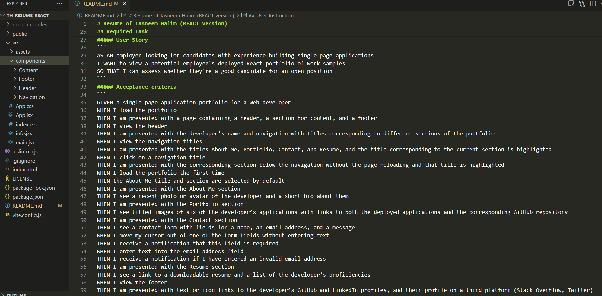
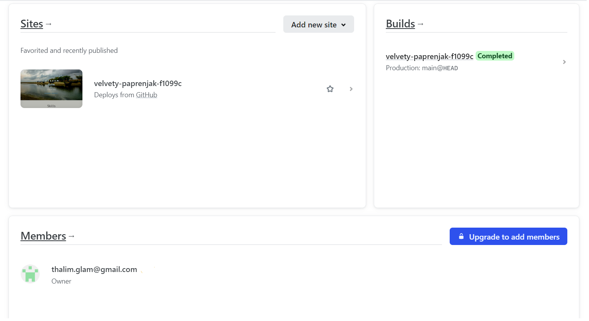
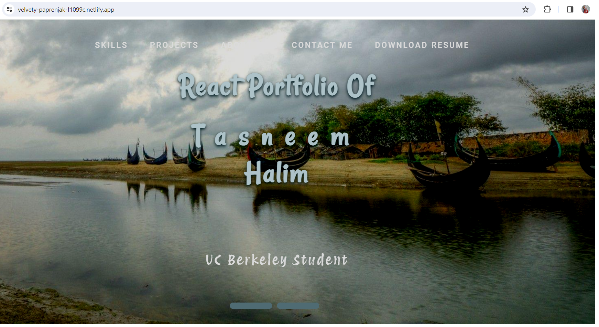
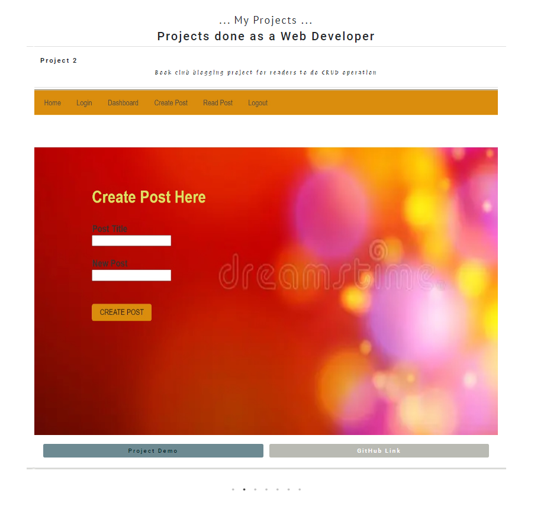

# Resume of Tasneem Halim (REACT version)

## Description
- This homework for UCBerkeley is to create a personal portfolio, using React skills to help set you apart from other developers whose portfolios don’t use the latest technologies.
 -  

## Table of Contents
  - [Installation](#installation)
  - [Required Task](#required-task)
  - [User Instruction](#user-instruction)
  - [Command line code](#command-line-code)
  - [Credits](#credits)
  - [License](#license)
  - [Tests](#tests)

## Installation

- Here are the installation process :
  - [1] Here is the repo for this project: https://github.com/thalim-glam/reactTHportfolio
  - [2] Here is the deployed link : 
  - [3] To create this project I used VSCode and "VITE 4.4.1"
  - [4] I have included all the necessary dependencies inside "package.json". 
  - [5] Make sure you have "React" installed.

## Required Task 

##### User Story 
```
AS AN employer looking for candidates with experience building single-page applications
I WANT to view a potential employee's deployed React portfolio of work samples
SO THAT I can assess whether they're a good candidate for an open position
```
##### Acceptance criteria
```
GIVEN a single-page application portfolio for a web developer
WHEN I load the portfolio
THEN I am presented with a page containing a header, a section for content, and a footer
WHEN I view the header
THEN I am presented with the developer's name and navigation with titles corresponding to different sections of the portfolio
WHEN I view the navigation titles
THEN I am presented with the titles About Me, Portfolio, Contact, and Resume, and the title corresponding to the current section is highlighted
WHEN I click on a navigation title
THEN I am presented with the corresponding section below the navigation without the page reloading and that title is highlighted
WHEN I load the portfolio the first time
THEN the About Me title and section are selected by default
WHEN I am presented with the About Me section
THEN I see a recent photo or avatar of the developer and a short bio about them
WHEN I am presented with the Portfolio section
THEN I see titled images of six of the developer’s applications with links to both the deployed applications and the corresponding GitHub repository
WHEN I am presented with the Contact section
THEN I see a contact form with fields for a name, an email address, and a message
WHEN I move my cursor out of one of the form fields without entering text
THEN I receive a notification that this field is required
WHEN I enter text into the email address field
THEN I receive a notification if I have entered an invalid email address
WHEN I am presented with the Resume section
THEN I see a link to a downloadable resume and a list of the developer’s proficiencies
WHEN I view the footer
THEN I am presented with text or icon links to the developer’s GitHub and LinkedIn profiles, and their profile on a third platform (Stack Overflow, Twitter) 

```

## User Instruction

  - Click here for deployed link : https://velvety-paprenjak-f1099c.netlify.app/
  - Click here for the repository: https://github.com/thalim-glam/TH-resume-react 
  - Click here for Readme file: https://github.com/thalim-glam/TH-resume-react/blob/main/README.md 
 
  - Sample screenshots :
    - Screenshot of VScode 
    - Screenshot of deployment 
    - Screenshot of Website 
    - Screenshot of six Projects 

    
## Command line code

I used the following command lines:
- npm run dev [ Or npm start to start the server ]
- npm i
- git status
- git add -A
- git commit -m "Comment goes here"
- git branch
- git pull origin main
- git push
- git checkout main
- git checkout -b feature/add-branch

## Credits

Thanks a lot to my Instructor, class recordings, my Tutor and groupmates, class friends and Google.  

## License

 [](https://opensource.org/licenses/MIT) 


## Tests
 - npm create-react-app
 - npm create vite@4.4.1 project_name
 - cd project_name
 - npm install
 - npm run dev
 - r = restart
 - u = show server url
 - o = open in browser
 - c = clear console
 - q = quit


### Done By: Tasneem Halim 😎